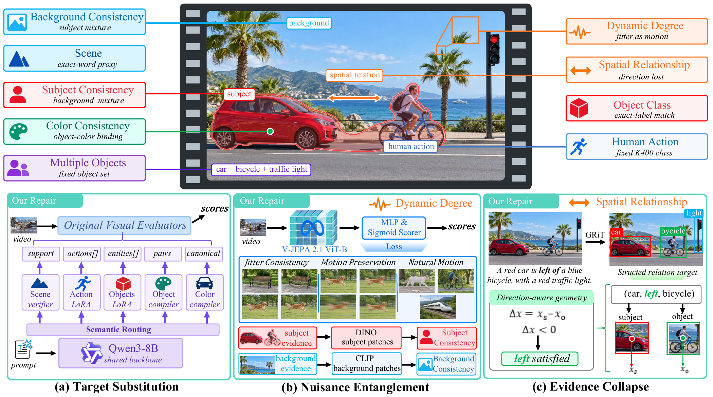

<div align="center">

# Aligning VBench Scores with Their Intended Targets:<br>Toward Faithful Video Evaluation

**Wenbiao Zhao<sup>1,*</sup>, Zichao Nie<sup>2,*</sup>, Shuyuan Meng<sup>1</sup>,<br>Meng Wang<sup>2</sup>, Haiwei Xue<sup>3</sup>, Panpan Zheng<sup>1,†</sup>**

<sup>1</sup> Xinjiang University &nbsp; <sup>2</sup> Tsinghua University<br>
<sup>3</sup> The Hong Kong University of Science and Technology

<sup>*</sup> Equal contribution &nbsp; <sup>†</sup> Corresponding author

[Data](https://huggingface.co/datasets/xju-arlab/vbench-repair) · [Models](https://huggingface.co/xju-arlab/vbench-model) · [Quick Start](#quick-start) · [Reproduction](docs/reproduction/README.md) · [Training & Data](docs/training.md)

</div>

**VBench Faithful** accompanies our manuscript on the measurement validity of video evaluation. We audit nine VBench dimensions, trace unintended score responses to their implementation, and develop targeted repairs. The evaluator supports all **16 official VBench 1.0 dimensions**, with the **nine paper-selected repairs** available through one configuration.

[](docs/assets/fig2.pdf)

*Overview of target–evidence misalignment and repair strategies. [PDF](docs/assets/fig2.pdf) · [Figure provenance](docs/assets/README.md)*

## Highlights

- **Three failure mechanisms.** Target Substitution replaces the intended property with an inequivalent proxy; Nuisance Entanglement mixes relevant and irrelevant evidence; Evidence Collapse discards information needed to distinguish target states.
- **Explicit behavioral tests.** Controlled counterfactuals separately test sensitivity to target changes and stability under irrelevant variation, with construction eligibility, missing scores, and paired denominators retained.
- **Repairs at the responsible stage.** Semantic target parsing, subject/background isolation, a frozen V-JEPA 2.1 motion encoder with a learned readout, and signed spatial geometry address different parts of the scoring pipeline. Text parsing alone cannot recover direction discarded by an unsigned geometric backend.
- **One evaluation command.** YAML configuration, automatic per-dimension environments, isolated model processes, shared model assets, and validated artifact reuse support repeatable evaluation without manually installing each dimension.

## Quick Start

### 1. Install and restore the models

Requirements: [uv](https://docs.astral.sh/uv/getting-started/installation/), Git, FFmpeg, Linux x86_64 (Ubuntu 24.04-compatible libraries), and an NVIDIA GPU. Allow about **100 GB of disk space** and **20–24 GB of free GPU memory** for the semantic models.

```bash
git clone https://github.com/winbeau/vbench-faithful.git
cd vbench-faithful
uv sync --locked

# One-time download of pinned models and isolated inference runtimes.
uv venv output/bootstrap --python 3.11.14
uv pip install --python output/bootstrap/bin/python 'huggingface_hub==1.32.0' requests
output/bootstrap/bin/python scripts/restore_paper_runtime.py \
  --output output/runtime --downloads output/runtime-downloads \
  --allow-official-fallback
```

The root uv environment uses Python **3.11.14**. The evaluator automatically prepares each dimension's environment and shares verified model assets and compatible dependencies. For system packages or interrupted downloads (`--resume`), see the [runtime recovery guide](docs/reproduction/CONTAINER_RESET.md).

### 2. Prepare your videos

For the standard VBench prompt suite, keep filenames such as `a white car-0.mp4` through `a white car-4.mp4`, then generate the input manifest:

```bash
uv run python scripts/prepare_vbench_inputs.py \
  --video-dir /absolute/path/generated-videos --output output/inputs.json
```

This attaches the official dimension metadata and subject annotations. For an intentional partial suite, add `--allow-missing` and evaluate only the dimensions present. Custom videos need explicit prompts and dimension metadata; see the [manifest format](docs/evaluation.md#configuration).

### 3. Configure and evaluate

The supplied [`configs/eval.yaml`](configs/eval.yaml) already points to the paths above. Its essential settings are:

```yaml
version: 1
input: ../output/inputs.json
assets: ../output/runtime/assets.json
backend: ours
dimensions: all
gpus: [0]
```

YAML paths are relative to the YAML file. Change `gpus` to select visible GPUs; for example, `[0, 1]` uses two. Run from the repository root:

```bash
# Default: all 16 dimensions = nine paper repairs + seven accelerators.
uv run python scripts/eval.py --config configs/eval.yaml

# Original VBench, all 16 dimensions.
./scripts/eval.sh --config configs/eval.yaml --backend official

# Optional: inspect the input and execution plan without model inference.
./scripts/eval.sh --config configs/eval.yaml --plan
```

Each command creates a new directory under `output/eval/`. Read `summary.json` for scores and coverage, `plan.json` for provenance, and the per-dimension `worker.log` files for model logs. Failed or unsupported scores remain `null`.

Useful options: `--dimensions paper` selects the nine repairs, `--dimensions color` selects one dimension, `--backend both` compares both modes, and `--no-reuse` forces fresh computation while allowing shared inference inside the current run. Repeated runs otherwise reuse verified cached artifacts. Legacy `repair` / `origin` names remain aliases for `ours` / `official`. Full configuration, environment and cache details are in the [evaluation guide](docs/evaluation.md).

The seven accelerators passed same-32 per-video checks against official scores: absolute error must be at most `max(1e-6, 0.01 × abs(official_score))`. This measures numerical agreement on the tested cohort, not perceptual quality or a guarantee for arbitrary inputs. [Optimization records](docs/plans/2026-10-08-speed32-optimization.md).

On the same 32 videos across all 16 dimensions, one H100 measured **344.60 s** for the default mode, **345.58 s** for official mode and **338.23 s** for the direct original single-process baseline. Our time decreased **37.82%** from 554.19 s and is within **1.88%** of the direct original. All 224 accelerated scores pass; existing partial coverage in three repairs remains explicit (459/512 project scores, 505/512 original). These single-run timings show near parity. [Full timing and numerical report](docs/validation/h100-same32-final-20261008.md).

The output contains `plan.json`, `summary.json`, per-dimension `origin.json`, `repair.json` or `accelerated.json`, and worker logs. Cache receipts identify reused stages. Failed, unsupported, or omitted scores remain `null`; incomplete coverage does not produce a complete-population mean. Official dataset aggregation is preserved, including dimension-specific scales and weighting.

## Supported Dimensions

`--backend official` selects the original VBench implementation for every row. The table describes the default route under `--backend ours`; `--dimensions paper` selects the nine repaired rows.

All **16 dimensions have independent packages under `metrics/`**. The four packages added to complete the workspace are [Aesthetic Quality](metrics/aesthetic-quality/), [Imaging Quality](metrics/imaging-quality/), [Temporal Flickering](metrics/temporal-flickering/), and [Appearance Style](metrics/appearance-style/). Their package CLIs use the same YAML, cache and isolated workers as the unified evaluator:

```bash
uv run aesthetic-quality --config configs/eval.yaml --backend origin
uv run imaging-quality --config configs/eval.yaml --backend origin
uv run temporal-flickering --config configs/eval.yaml --backend origin
uv run appearance-style --config configs/eval.yaml --backend origin
```

Each command fixes its own dimension; YAML `dimensions: all` does not expand a dimension-specific command. Use `scripts/eval.py` for a multi-dimension run. The other twelve package CLIs retain their documented research interfaces.

| Dimension | CLI key | Default route (`ours`) |
|---|---|---|
| Scene | `scene` | **Repair:** Qwen3-8B verifier over fixed Tag2Text caption evidence |
| Human Action | `human_action` | **Repair:** action parsing, canonical K400 targets, and declared synonym interface over UMT evidence |
| Object Class | `object_class` | **Repair:** prompt target compilation with case, word-form, and declared-alias normalization over GRiT evidence |
| Subject Consistency | `subject_consistency` | **Repair:** independent Mask R-CNN/MobileSAM localization, subject isolation before encoding, and DINO patch comparisons |
| Background Consistency | `background_consistency` | **Repair:** independent foreground localization, CLIP background patch pooling, and the selected calibrated frame-pair score |
| Dynamic Degree | `dynamic_degree` | **Repair:** frozen V-JEPA 2.1 ViT-B encoder and the 51,393-parameter aligned-v1 continuous scoring head |
| Spatial Relationship | `spatial_relationship` | **Repair:** ordered relation targets and direction-aware signed geometry |
| Multiple Objects | `multiple_objects` | **Repair:** variable-length entity parsing and adjacent-frame detection confirmation |
| Color | `color` | **Repair:** target-instance color binding with all sampled frames in the denominator |
| Motion Smoothness | `motion_smoothness` | **Accelerated:** Batched AMT interpolation |
| Temporal Flickering | `temporal_flickering` | **Accelerated:** Streaming CPU frame differences |
| Aesthetic Quality | `aesthetic_quality` | **Accelerated:** Batched CLIP visual tower and native aesthetic head |
| Imaging Quality | `imaging_quality` | **Accelerated:** Batched FP32 MUSIQ |
| Temporal Style | `temporal_style` | **Accelerated:** Batched ViCLIP |
| Overall Consistency | `overall_consistency` | **Accelerated:** Batched ViCLIP with current-run video feature reuse |
| Appearance Style | `appearance_style` | **Accelerated:** Batched CLIP and cached text embeddings |

The selected methods and asset identities are fixed in [`paper-methods.json`](configs/reproduction/paper-methods.json). Subject uses `hybrid / exclude / preencode_crop`; Background uses `patch_frame_calibrated` with the frozen gain of 1.75. Legacy per-dimension research CLIs and the historical eleven-dimension development scope remain documented separately; their defaults are not the paper method selection.

**Dynamic input contract:** aligned-v1 accepts the paper protocol of **16 native square RGB frames at 8 FPS**. It does not silently crop, duplicate frames, resample an incompatible clip, or recalibrate the score. The continuous output measures relative motion on the learned scale, not calibrated physical motion intensity. Rectangular full-frame adaptation belongs to the separately documented [external validation](docs/reproduction/DYNAMIC_GENERALIZATION.md).

## Training and Data Construction

Training and data construction are retained for the paper-selected versions: six semantic adapters, Dynamic aligned-v1 with its required probe → anchored initialization, Subject official720 v9, and the frozen Background heldout protocol. The [training guide](docs/training.md) lists exact versions, construction entries and commands. Selected semantic training code lives in `scripts/semantic/`; selected configurations live in `configs/training/`. Superseded candidate pipelines are archived in Git history. The [cleanup validation](docs/validation/selected-workflows-20261008.md) checks the retained training entries and a fresh same-32, all-16 H100 run.

## Reproduction and Interpretation

The [reproduction guide](docs/reproduction/README.md) distinguishes frozen evidence replay, representative model inference, full-dataset GPU reruns, and training. It links the selected weights, training inputs, initialization chain, exact configurations, and verification receipts.

- **Frozen main-table replay:** the checked-in [nine-dimension table](docs/reproduction/verified-nine-dimension-replay/main-table.csv) uses complete pairs shared by all four Origin/Repair × original/counterfactual cells. Missing pairs are retained in coverage reporting. The original Object Class and Color table uses metadata-based repairs; the CLI uses the selected LoRA repairs, whose validation scope is described in the [Object/Color report](docs/object-color-repair.md).
- **Representative inference checks:** installation verification runs real models on representative inputs. These checks do not establish a full-dataset rerun or retraining result. Cached score replay likewise does not count as fresh GPU inference.
- **Unified evaluator acceptance:** [four-H100 validation](docs/validation/h100-eval-20261008.md) completed 16 official tasks and nine repaired tasks. All 19 repaired fixture records matched the frozen expected scores exactly; the default 16-dimension combination reused all tasks successfully.
- **Performance and package acceptance:** [single-H100 follow-up](docs/validation/h100-performance-20261008.md) validates all 16 independent packages. Parallel full-file verification reduced the controlled nine-repair fixture from 220.38 s to 181.63 s with all 19 scores unchanged; the final-version warm run took 13.22 s using cached artifacts.
- **Scope of the evidence:** score stability is different from accuracy, and a stable mean does not imply every video is stable. Dynamic's 450-source experiment uses 30 previously exposed prompts, averages two perturbation seeds within each source, and retains individual failures and earlier development-gate failures.
- **Construction and model limits:** predicted masks are not segmentation ground truth; declared synonym contracts do not establish open-ended semantic generalization. Detection confirmation can remove genuine positives as well as false positives. The [Multiple Objects review](docs/counterfactual-reports/multiplt_object.review.md) records additional interpretation limits.

Historical negative results, rejected constructions, and paused experiments remain available in the [experiment index](docs/EXPERIMENT_INDEX.md) and [rejected/paused experiment guide](docs/reproduction/REJECTED_EXPERIMENTS.md). The repairs should be interpreted within those measured contracts rather than as a claim of uniform improvement across every video or benchmark.

## Development

See the [evaluation guide](docs/evaluation.md), [evaluation skill](skills/vbench-eval/SKILL.md), [development guide](docs/development.md), and [architecture notes](docs/architecture.md). Each metric owns its scoring implementation; shared input, scheduling, output, and provenance infrastructure lives in `packages/audit-core/`, and shared model adapters live in `packages/audit-models/`.

The working tree contains the evaluator and its paper reproduction evidence:

| Directory | Purpose |
|---|---|
| `metrics/` | All 16 independent dimension packages |
| `packages/` | Shared infrastructure, model adapters, and the integrated paper semantic compiler |
| `scripts/` | Evaluation, selected training and data construction, reproduction, validation, and Git hooks |
| `configs/` | Evaluation YAML, selected training/construction protocols, and pinned assets |
| `docs/` | Paper figures, reproduction protocols, and measured results |
| `tests/`, `skills/` | Contract tests and the evaluation skill |
| `output/` | Local downloads, environments, caches, and new results (ignored by Git) |

The early E0 baseline, its data/splits, and superseded supplementary figures have been removed. They remain recoverable from Git history; see the [cleanup record](docs/reproduction/REPOSITORY_CLEANUP.md). The semantic compiler now lives in `packages/prompt-compiler/`, with no nested vendor repository or lockfile. AOCI state is local developer tooling and is not published.

Use a new `output/` directory for experiments. Model weights and external checkouts stay outside version control. Dynamic Degree and Motion Smoothness reuse official Subject Consistency video files, which does not imply shared formulas or human annotations.

## Citation

Citation information for the current manuscript:

```bibtex
@misc{zhao2026aligningvbench,
  title  = {Aligning {VBench} Scores with Their Intended Targets:
            Toward Faithful Video Evaluation},
  author = {Zhao, Wenbiao and Nie, Zichao and Meng, Shuyuan and
            Wang, Meng and Xue, Haiwei and Zheng, Panpan},
  year   = {2026},
  note   = {Manuscript},
  url    = {https://github.com/winbeau/vbench-faithful}
}
```
