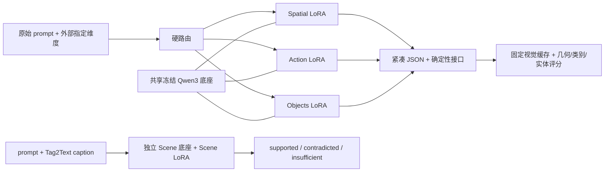

# 小模型与组件消融方法

主协议见[预先固定的计划](../../plans/16-ablation-generalization.md)。数据、参数与实现冻结之后才运行本轮预测；原有回归结果与新挑战分表。

## 架构与训练控制

| 属性 | Qwen3-0.6B | Qwen3-8B |
| --- | ---: | ---: |
| 冻结底座参数 | 596,049,920 | 8,190,735,360 |
| Transformer 层数 | 28 | 36 |
| hidden size | 1,024 | 4,096 |
| FFN intermediate size | 3,072 | 12,288 |
| attention heads / KV heads | 16 / 8 | 32 / 8 |
| head dimension | 128 | 128 |
| vocabulary size | 151,936 | 151,936 |
| 共享输入/输出 embedding | 是 | 否 |
| 单个 LoRA 可训练参数 | 10,092,544 | 43,646,976 |
| LoRA rank / alpha / dropout | 16 / 32 / 0 | 16 / 32 / 0 |

结构数值来自本地 `config.json` 与实际 parameter inventory；两者都是 Qwen3 dense decoder，采用分组查询注意力，支持关闭 thinking。本轮固定 non-thinking、BF16、greedy 推理。[Qwen3 技术报告](https://arxiv.org/abs/2505.09388)



LoRA 只更新各线性层的低秩增量，底座冻结，采用公开的[低秩适配方法](https://arxiv.org/abs/2106.09685)。三个解析任务按维度切换 adapter；Scene 单独加载，无自主路由、无另加末端 LLM matcher。关闭 LoRA 就得到同底座、同指令的 base 对照。四个 0.6B adapter 本轮重新训练，复用当前 8B 的全部训练配置；只改底座路径、revision 和输出目录。Spatial/Scene/Action/Objects 步数分别为 600/300/300/900，训练样本数为 2679/455/605/7688。

这是固定 rank、数据与更新次数的规模/结构对照，不是严格等参数预算实验：LoRA 参数数量与占比、层数和 embedding 绑定都随规模变化。单 seed 不估计训练随机性。未测试其他模型家族、联合 adapter、全参微调、分类头或量化，不能把这些写成已完成的消融。

## 评估集合与边界

- 主挑战：每维 24 个语义家族，每家族 canonical、paraphrase、changed、composition、long head/middle/tail 共 7 条；合计 672 条。长度压力为 218–226 词的风格文本，条件位于不同位置。它不是自然长提示词语料。
- 原始 Action 24 类中，21 类曾出现在当前 train/dev；19 条 canonical 及对应 changed 句子有精确规范化文本重合。Scene 3 条 canonical/changed 句子有重合。新改写、组合与长文本无此重合；24 条新 Action 改写不在旧 60 对别名字典中。类别见过与表达见过是不同概念。
- SNLI 官方 test：固定筛选含位置表述的短 hypothesis，按原始 premise 分组并排除当前 train/dev 规范化文本重合。按每类最多 30 取样，少数类耗尽后得到 30 supported、25 contradicted、19 insufficient，共 74 条。保留原始人工 NLI 标签，报告 accuracy 与 macro recall；标签针对完整假设，部分假设还带人物/活动限定，因此这是跨任务迁移诊断，不冒充 Scene 专用或 Tag2Text 三标签人工真值。[SNLI 数据说明](https://nlp.stanford.edu/projects/snli/)
- 已有 dev：按 source family 取最多 48 个样本。Scene 全部 dev 实际只有一个连接分量，因此只取到 1 条；该数不可用于独立泛化结论。Spatial 48、Action 47、Objects 48；这些 dev 已在训练中记录，不能称新盲测。
- 推理前补充 60 条边界诊断：24 条未实际执行动作、24 条 inside/behind（四方向输出空间不支持）、12 条作者判定的 K400 词表外动作。单独报告，不改变主 WG-CC 分组。词表外标签仍需独立人工审查，尤其是相近动作的分类边界。

共 950 条输入；每个规模 base/SFT 各评一次。Scene 的 24 个 canonical 与 74 个 SNLI 输入额外评去 caption、固定错配 caption，共计划每种规模 2,292 次预测，总计 4,584 次。全部输入最多 1,792 tokens，解析输出最多 128 tokens、Scene 最多 8 tokens（换行边界）。超预算和无效输出不删除、不截断为成功。

固定旧审计规则（字符相似度 ≥0.90 或 ≥12 词逐字包含）还标记 Spatial 各 2 条 canonical/changed 近似训练文本；其余新改写、组合、长文本、边界与 SNLI 的 prompt 未命中。所有样本保留。四任务 train/dev 来源家族交叉为 0。该审计只筛查已记录的微调文本，不证明语义来源独立或基模未见。

## 指标如何约束捷径

令家族 f 的原始和变换输出正确指示为 c(f,0)、c(f,t)。每个组 g=(维度,变换) 的 `CC(g)=mean_f[c(f,0) × c(f,t)]`，主指标 `WG-CC=min_g CC(g)`。语义不变时两端应符合相同目标；语义改变时必须分别符合不同目标。解析失败、缺失和对确定目标弃权均不能得分；真正的 insufficient/other/空目标仍可作为正确标签。

空间语义匹配允许等价的主客体交换加反向关系；集合次序和大小写不影响 exact target。没有模糊实体匹配或教师二次裁决。Raw 保留冠词等接口错误，interface 只应用已有 Action 修复与 Spatial 冠词序列化；Objects 的时序后端在视频组件表中评估，不能套到纯文本正确率。

每个系统的名义同时 95% Wilson 下界以 24 个预声明组作 Bonferroni 校正，并报告家族 bootstrap 的变换减 canonical 正确率差（2,000 次）。没有再对不同系统作同时校正，不据此选择最优模型。长文本非劣效参照固定 −0.03。24 个家族较小，即便 24 组全部满分，同时下界也仅为 **0.7451**。这些作者构造的家族共享模板、非随机自然样本，因此下界只是独立家族近似下的诊断，不是部署可靠性保证。

Oracle、复制 canonical 的 Oracle、恒定空/insufficient 控制同时运行；后两者应在改变语义的组失败。纯一致性可被常量预测利用；与正确目标绑定的成对指标避免这一问题。行为测试组织参考 [CheckList](https://aclanthology.org/2020.acl-main.442/)，最差组诊断动机参考 [worst-group generalization 分析](https://arxiv.org/abs/1911.08731)，没有声称实现 Group DRO 训练。

Scene 去 caption/错配 caption 的表格保留 intact 标签，用于测量移除证据后的原任务表现；它们不是新输入的正确标签，因此不能把该表的降分直接称作模型错误。另观察去 caption 是否输出 insufficient。

## 复现

原始协议与工程种子、数据、预测、训练产物位于忽略目录，以 SHA 绑定。初版冻结数据 `data/ablation-v1/eval.jsonl` 保留不覆盖；附加边界集在 `boundaries.jsonl`，合并为 `eval-extended.jsonl`，manifest 记录初版 SHA 和推理前补充说明。

```bash
uv run --no-sync python scripts/build_ablation_eval.py
# 已冻结的文件拒绝覆盖；已有工作区直接使用 eval-extended.jsonl。
uv run --no-sync python scripts/predict_ablation.py \
  --data data/ablation-v1/eval-extended.jsonl \
  --config configs/ablation/v1/eval-8b.json \
  --out output/ablation-v1/predictions-8b.jsonl
uv run --no-sync python scripts/score_ablation.py \
  --data data/ablation-v1/eval-extended.jsonl
```

服务器训练与推理位于 `/data1/wenbiao_zhao/vbench-ablation-v1` 的隔离快照，复用锁定环境和现有数据、权重。四份数据 SHA 与当前 8B 原训练 manifest 一致。只使用已授权的 RTX4090 GPU 5；本轮不需要生成新视觉缓存。原有 8B 结果和 Origin 评分实现保持原样。
